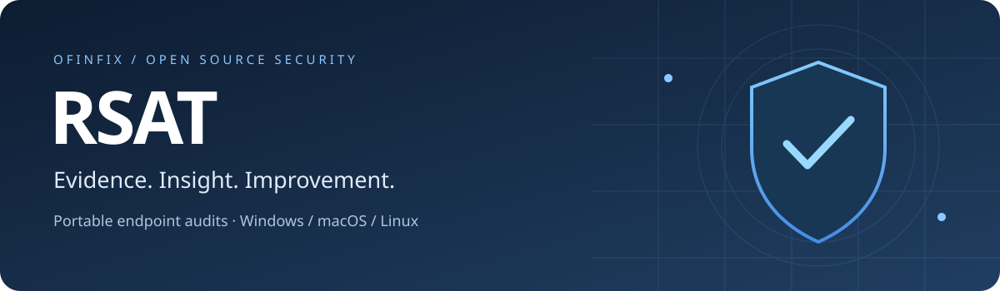
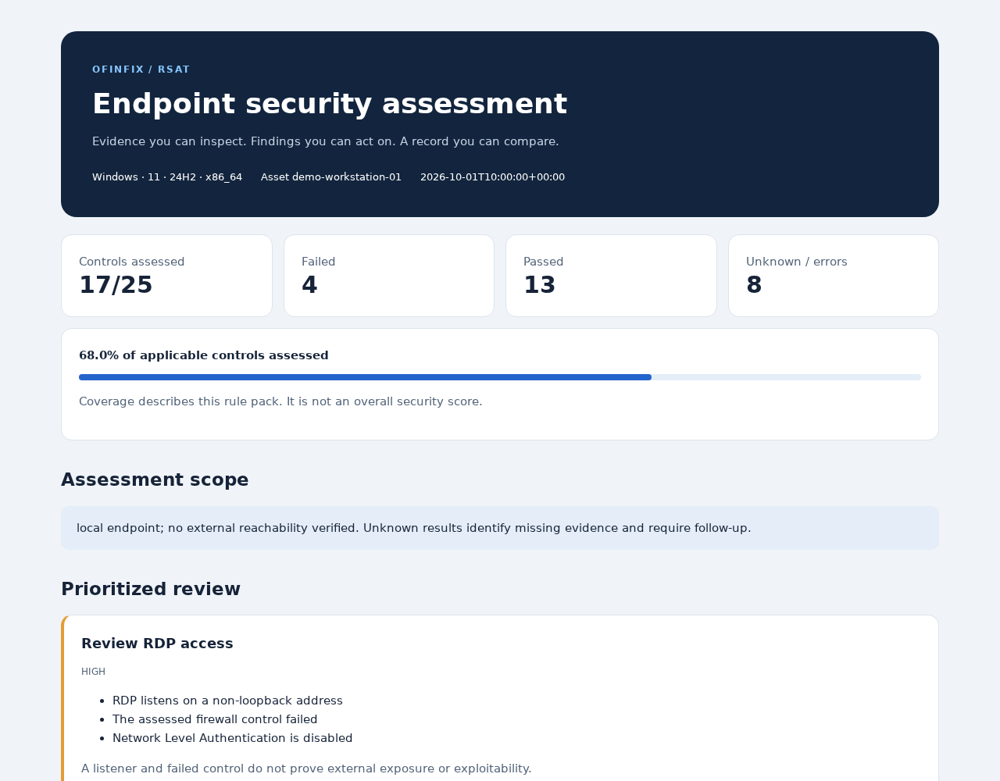
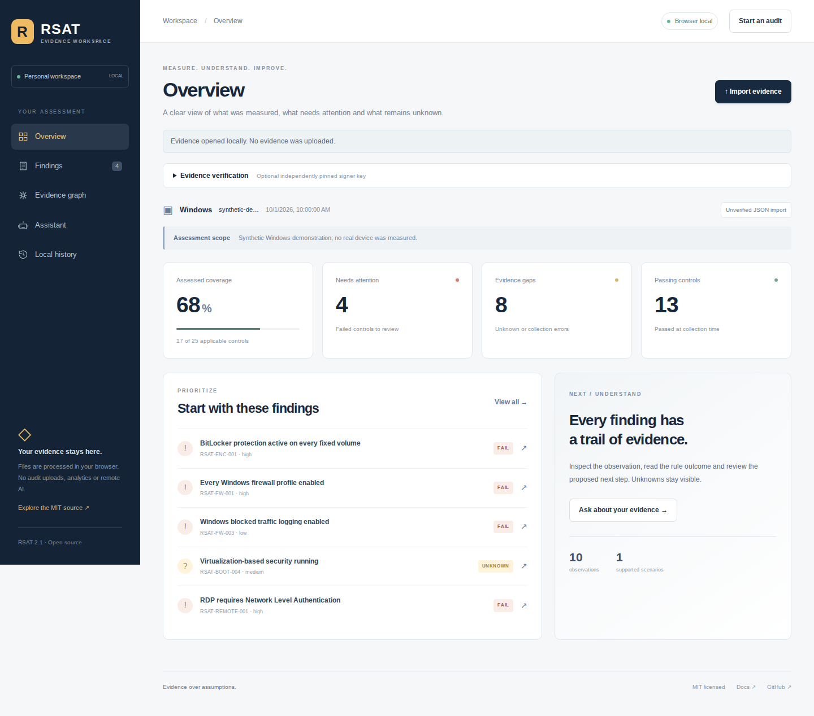
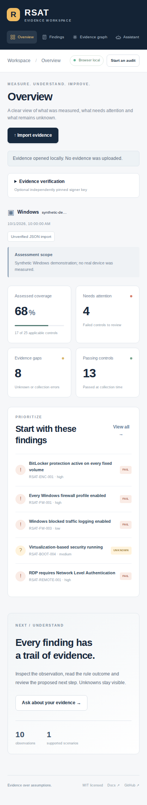
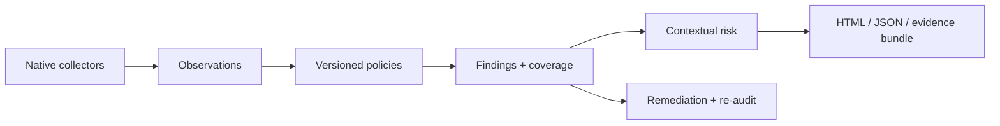

<p align="center">
  
</p>

<p align="center">
  <a href="https://github.com/Kajahkura/RSAT_Project/actions/workflows/build.yml"></a>
  
  <a href="LICENSE"></a>
  
  
</p>

<p align="center"><strong>Endpoint and AI tooling security, grounded in evidence.</strong><br>Inspect the evidence. Prioritize the work. Verify the improvement.</p>

<p align="center">
  <a href="#quick-start">Quick start</a> · <a href="docs/usage.md">Usage guide</a> · <a href="docs/architecture.md">Architecture</a> · <a href="docs/validation.md">Validation</a> · <a href="CONTRIBUTING.md">Contribute</a>
</p>

RSAT is an open-source Remote Security Audit Tool that runs a bounded, read-only endpoint assessment and produces a self-contained HTML report, structured JSON, and a remediation plan. It works locally without a persistent agent or a required cloud service. The optional [browser workspace](web/) adds local imports, independently pinned bundle verification, evidence inspection and encrypted local history. Optional workflows add existing SSH/HTTPS WinRM collection, signed evidence, recipient encryption, vulnerability intelligence, and comparisons across audits.

## An audit you can inspect

Every conclusion links to collected evidence and a versioned rule. PASS, FAIL, UNKNOWN, ERROR, and NOT_APPLICABLE remain distinct. Coverage shows how much of the applicable policy was assessed; it is not an overall security score.



*Synthetic demonstration data; no customer endpoint information is included.*

| Capability | What you get |
|---|---|
| **42 original controls** | Disk protection, firewall, endpoint defense, boot protections, remote access, identity, updates, backup evidence, and management checks |
| **Traceable findings** | Stable control IDs, policy versions, collection source, outcomes, severity, and recommended actions |
| **Contextual review** | Non-loopback service relationships, failed controls, and explainable vulnerability priority factors |
| **Portable reporting** | Responsive standalone HTML, JSON, printing, and local multi-endpoint overview |
| **Verifiable evidence** | SHA-256 manifests, Ed25519 signing, pinned-key verification, and X25519/AES-GCM recipient encryption |
| **Progress tracking** | Resolved findings, regressions, policy changes, and expiring exceptions |
| **Explicit remediation** | Manual plans plus a small allowlist with dry-run, backup, execution, verification, and rollback |
| **Optional integrations** | osquery, existing SSH access, second-host TCP probes, offline advisories, OSV/KEV/EPSS, OSCAL, and local AI summaries |

## New in 2.1

| Capability | Concrete behavior |
|---|---|
| **AI tooling assessments** | Five original rules for model listeners and explicitly selected MCP configuration declarations; secrets are excluded |
| **Grounded assistance** | Offline evidence retrieval, exact audit-bound model claims, fixed read-only rechecks and an MCP stdio interface |
| **Evidence relationships** | Provenance-bearing graph exports and clearly conditional change simulations |
| **Signed device history** | Hash-linked snapshots, replay-resistant enrollment, scoped self-hosted tokens, retention and bounded foreground watch |
| **Portable intelligence** | CycloneDX SBOM/ML-BOM, OCSF compliance events, pinned publisher VEX/CSAF, explicit external-context contracts |
| **Reviewed updates and policies** | Maintained TUF download verification and constrained policy drafts with outcome fixtures |

See the [platform guide](docs/platform.md) for commands, trust boundaries and integration prerequisites. Hardware attestation, automatic fleet installation, provider-specific cloud mappings and end-to-end encrypted cloud sync are not implemented.

### Browser workspace

Start with operating-system-specific onboarding, open evidence locally, inspect findings and relationships, and keep encrypted history in your browser. Download the static workspace from the [2.1.0 release](https://github.com/Kajahkura/RSAT_Project/releases/tag/v2.1.0) or follow the [self-hosting guide](docs/deployment.md).



<details>
<summary>Mobile preview</summary>

</details>

*Screenshots use synthetic evidence. BlinkHost publication is pending authenticated access; the release ZIP supports independent static hosting.*

## Quick start

Download a portable binary from the [latest release](https://github.com/Kajahkura/RSAT_Project/releases/latest), verify its published checksum/provenance, or run from source. The legacy 1.0 release uses less reliable checks; it does not contain the features described here.

```bash
git clone https://github.com/Kajahkura/RSAT_Project.git
cd RSAT_Project
python -m venv .venv
source .venv/bin/activate  # Windows: .venv\Scripts\activate
python -m pip install -e .
rsat audit
```

Open `audit-output/<audit-id>/report.html`. Reports are created with unique audit IDs and do not overwrite an earlier audit.

Run with the privileges appropriate for your engagement when native checks need them. RSAT does not automatically elevate or apply fixes. A completed audit can contain unknown or failed queries; review coverage and evidence.

```bash
# Opt into deeper inventory and bounded live update checks
rsat audit --inventory --update-search --deadline 120 --command-timeout 20

# Compare the same asset across two audits
rsat diff before/audit.json after/audit.json --output changes.json

# Create a local engagement overview
rsat workspace laptop/audit.json workstation/audit.json --output engagement.html
```

## Platform coverage

| Domain | Windows | macOS | Linux |
|---|---|---|---|
| Disk | BitLocker protection, encryption, protector types on fixed volumes | FileVault state and progress | Storage inventory; no generic encryption assurance claim |
| Firewall | Effective per-profile state, inbound default, logging | Application firewall, stealth and block-all observations | nftables input policy; other backends need separate evidence |
| Network | IPv4/IPv6 listeners, process association, UDP endpoints | TCP listeners and process association | TCP listeners and process association |
| Endpoint and boot | Defender, signatures, TPM, Secure Boot, VBS | SIP, authenticated root, Gatekeeper | Secure Boot where supported |
| Remote and identity | RDP NLA, SMBv1/signing, guest, UAC, administrator inventory | SSH status, guest, administrator inventory, MDM | Effective SSH configuration, UID-zero accounts |
| Updates and recovery | Reboot indicators, installed hotfix inventory, optional live update search | Schedule, history, optional live update search, Time Machine evidence | Reboot indicator on supported distributions, update timers, audit service |

Policy applicability depends on device role. Missing data does not pass. Backup timestamps do not prove successful restoration. A listening service does not establish external reachability or a vulnerability. OS support, proprietary software advisories, and organizational compliance require version-specific and external evidence.

## Evidence and remediation

```bash
python -m pip install -e '.[crypto]'
rsat keygen keys
rsat audit --bundle --signing-key keys/signing.key.pem --recipient-key keys/recipient.pub.pem
rsat verify evidence.rsat.zip --trusted-key keys/signing.pub.pem

rsat plan audit.json --output plan.json
rsat apply plan.json windows-firewall-enable --backup firewall-before.json
```

`apply` defaults to dry-run. Execution is a separate opt-in with privileges and recovery-access acknowledgment. Signing verifies bytes and signer identity when the public key is pinned independently; it does not prove endpoint health. Encryption creates a transfer artifact while local plaintext outputs remain. See the [usage guide](docs/usage.md) and [security policy](SECURITY.md).

## Designed for extension



The core uses Python for audit orchestration and policies, PowerShell/CIM for Windows queries, native macOS/Linux interfaces, HTML/CSS/JavaScript for standalone reports, and React/TypeScript for the browser workspace. Cryptography uses maintained standard primitives. The [architecture guide](docs/architecture.md) explains the module boundaries and trust model.

```text
src/rsat/       collectors, policy, analysis, trust, interfaces, CLI
web/            React/TypeScript browser-local evidence workspace
tests/          regressions, integration boundaries, security cases
scripts/        native smoke tests, packaging, release inventory
docs/           architecture, usage, validation, design rationale
examples/       synthetic audit, policy exceptions, advisory format
.github/        native CI, issue and PR templates, dependency updates
```

## Test and build

```bash
python -m pip install -r requirements-dev.txt -e .
python -m ruff check src tests scripts
python -m pytest --cov=rsat --cov-fail-under=80
python scripts/native_smoke.py
python scripts/build.py
```

CI runs Python 3.11/3.13 tests on Linux, Windows, and both macOS architectures, then builds and smoke-tests standalone executables. Tagged releases publish checksums, build-environment inventories, and provenance. OS Authenticode signing and Apple notarization require maintainer certificates and are not currently configured. See [validation](docs/validation.md) for measured results and limits.

## Open source, throughout

RSAT code, original controls, reports, advanced analysis, and repository artwork use the [MIT license](LICENSE). There is no proprietary feature tier. Hosting, support, training, and consulting can support the project without closing its implementation.

Optional tools, intelligence data, and local models retain their own licenses. No restricted CIS benchmark text is bundled. See [third-party notices](docs/third-party-notices.md), [contributor guidance](CONTRIBUTING.md), and the [changelog](CHANGELOG.md).

RSAT is a point-in-time assessment tool for authorized use. It does not certify compliance, detect every vulnerability, or establish that an endpoint is uncompromised.
