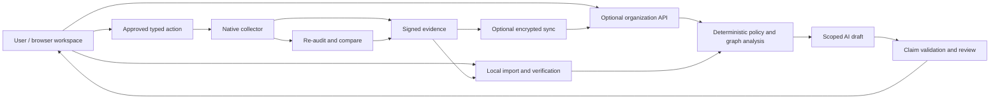

# RSAT: advanced AI capabilities and BlinkHost web architecture

Research conducted 1 October 2026; completed 5 October 2026. BlinkHost current-version metadata was rechecked on 5 October. Baseline: RSAT 2.0.1, repository main `88530aa`. This is an architecture and research proposal, not a claim that the proposed capabilities are implemented.

## Assessment and recommendation

RSAT should develop into an evidence workspace for endpoint and AI-system security. Its strongest opportunity is connecting a local audit to a comprehensible explanation, a precise follow-up measurement, a reviewed action, and a verified improvement. A hosted web app can make that workflow accessible without replacing the native collector.

The current foundation is useful: explicit outcomes, normalized observations, constrained policies, bounded collection, signed/encrypted evidence, comparisons, and native packaging. The AI adapter is an initial cited-summary feature. It is not an evidence-grounded conversational analyst or an autonomous auditor. The contextual analyzer implements a small set of listener/control and vulnerability relationships rather than a general attack graph.

Recommended sequence: correct measured collection/AI gaps; publish local-processing web onboarding; build an evidence-grounded copilot and AI-security rules; add verified device enrollment and continuous assessment; then deepen graph reasoning, controlled remediation, and team integrations. Keep these features in the open-source implementation, with hosting and model providers optional.

## Experiments on this PC

A read-only Linux/WSL audit with installed-software inventory completed in 33.98 seconds. It produced 42 findings: 33 not applicable, 2 passes, 1 failure, 4 unknowns and 2 collection errors. Three of nine applicable controls were assessed, giving 33.3% coverage. It inventoried 571 installed packages. Disk enumeration timed out and systemd-related queries failed. These are scope and coverage results, not a Windows host security verdict.

The nftables default-input control failed inside WSL. This does not establish that the physical Windows host has an ineffective firewall. Virtualization context and independently collected host controls must be distinguished.

A no-network experiment called the current OSV adapter with that inventory. Package ecosystem labels were lowercase `ubuntu`; the adapter recognizes `Ubuntu`. It skipped 500 packages and returned no matches without a network request. The remaining 71 packages were not accounted for in its skipped output. Changing case alone is insufficient: reliable distro matching also needs release, source/binary package relationships, epochs, architecture and vendor backport semantics.

A loopback mock AI server returned the false statement that all controls passed and the firewall was correctly configured, with a citation to the actual failed control `RSAT-FW-006`. The summary adapter accepted it and marked it for human review. This demonstrates that ID citation validation does not establish claim truth. No actual language model was used in that test.

A disposable onboarding prototype was scaffolded with the installed BlinkHost CLI. Its manifest validation passed without warnings and `blinkhost test` passed. For a static HTML project that command is validation; it is not a browser test or a successful deployment. Separate Chromium tests passed command selection, the inventory toggle, importing the real WSL audit, escaping a hostile HTML title, desktop rendering and 390px mobile layout. A supplementary expanded replay was stopped after prolonged browser-driver startup in this resource-constrained workspace; it is not recorded as a pass. Its script, `check_onboarding.py`, adds all four OS/architecture choices, malformed JSON rejection and network-request monitoring for the next validation run. The earlier completed browser checks remain the verified results. Screenshots accompany the prototype.

A checksum-verified Windows release collector was also launched through WSL against the native Windows environment, with a 90-second audit deadline, 15-second query limit and no remediation. The launch exceeded the outer 240-second experiment timeout without creating audit output. This is an incomplete native experiment, not a pass, and does not establish whether launch/extraction, WSL interoperability or a query was responsible. This workspace has substantial process and filesystem latency. Add launch-stage diagnostics, an outer watchdog and bounded extraction/query timing; diagnose the affected environment before drawing a Windows-host conclusion. There is no assumption that a WSL audit covers the Windows host.

Raw audit files remain outside the Git repository. The prototype has no upload API, remote AI, account service or analytics. Real evidence should not be published as site assets.

## BlinkHost: suitability and boundaries

The installed CLI is 2.4.0. Official npm metadata and GitHub releases show 2.5.2 as the current published release (27 September 2026); Node >=22.12 is required. The current release adds recovery of uncertain deployment publication requests, and 2.5.1 addressed saved-session concurrency. Version 2.5.2 activate/promote/retry/rollback requires a saved idempotency key; after an uncertain response inspect the same request instead of submitting a new key. Version-matched documentation should govern actual commands.

Official documentation supports HTML, Astro, React, Solid, Svelte and Vue frontends, and modules in Rust, TinyGo, Python, JavaScript and TypeScript. The backend is a capability-based WASI runtime with bounded memory, execution, payloads, operations and outbound destinations. JavaScript/TypeScript/Python modules use compatibility layers and do not imply support for arbitrary native extensions, subprocesses or persistent server frameworks. Python/JS/TS functions and asynchronous triggers include beta/rollout limitations.

This fits a frontend, compact broker functions, declared database/object-store access, and some deterministic analysis. It does not mean RSAT's native collector or PyCryptodome extension can be deployed unchanged as a function. It is not an appropriate home for a GPU model server. Use browser/SDK-supported crypto after compatibility tests, or a separate conventional worker for native cryptography and deeper analysis. Model inference should be local or on an explicitly configured inference service.

BlinkHost's current public plan table lists no managed database or outbound HTTP on Free. Paid plans govern those capabilities; Free storage is 100 MB and runtime memory 128 MB. Verify the actual organization entitlements before promising team audit history or remote AI. Marketing or IDE AI credits must not be assumed to grant an application inference API.

Local readiness passed Node/Git checks, but Linux Secret Service is unavailable. Earlier workspace notes record an authenticated native Windows CLI using Password Vault; that session has not been revalidated during this research. The service's workspace roles are deployment controls; RSAT must implement its own customer identity, authorization and tenant isolation.

Deployment is an exact-source build, verified immutable artifact, inspected preview, and production promotion. Use the reviewed source revision and saved request identity throughout. The documented command is a deployments resource workflow, not an assumed top-level `blinkhost deploy` command. A production rollback references a prior artifact without rebuilding it. The research prototype has not been remotely deployed.

## Web onboarding and trust design

Start with a polished static site: explain scope, choose OS/architecture, download the verified collector, run a clear command, open the report, and optionally import the audit into a browser-local workspace. Provide a synthetic interactive demo before installation. Keep the first assessment usable without an account.

The browser-local workspace should parse bounded JSON/ZIP in a Web Worker, validate its schema, escape rendered data, and verify signed bundles against independently pinned keys. IndexedDB can retain local history with explicit retention/deletion controls. Encrypt sensitive retained data; browser storage alone is not encrypted custody. Signatures establish signer trust only with independent pinning.

For automatic onboarding, an installed collector can use device authorization or a short-lived pairing code. Bind enrollment to an organization, purpose, nonce, expiry and device-generated public key. Use revocable device identity, least-privilege scopes, replay-resistant uploads and separate encryption/signing keys. Protect keys with OS custody when supported. The present hostname fingerprint is not suitable as an enrollment identity.

If a local companion bridge is used, make it a separate bounded service. Authenticate each session, enforce exact allowed origins and Host headers, defend against CSRF/DNS rebinding, require local action authorization, and expose typed capabilities. A public page must not obtain a general localhost shell. Browser localhost/private-network restrictions also need a tested cross-browser fallback.

Cloud synchronization can store encrypted evidence and a minimal searchable index. Decide explicitly whether the server can decrypt: encrypted client-only custody prevents server-side evidence search/AI unless selected material is shared. Define key recovery, account revocation, retention, audit trails and tenant isolation before calling this end-to-end encrypted. Keep a self-hosted deployment path.

## Proposed architecture

Browser-local and cloud modes have different data-custody properties. A browser-only mode can keep evidence out of the hosted service; remote analysis requires an explicit disclosure/sharing boundary.

## Sophisticated capabilities

| Capability | Concrete behavior | Engineering and proof required |
|---|---|---|
| Evidence-grounded copilot | Answer questions about why controls failed, what is unknown, and what changed, citing exact observation fields and rule versions. | Structured claims carrying observation IDs/JSON pointers, freshness and scope; deterministic status checks; retrieved trusted policy/vendor sources; unsupported-claim rejection and abstention. Evaluate against contradictory, stale and malicious evidence. |
| Adaptive assessment | Select the next useful read-only check when a finding is ambiguous or evidence is missing. | Predefined collector capabilities, schema-validated parameters, expected information gain, cost/privilege/network budgets and stop conditions. No model-generated privileged scripts. Compare coverage gain per unit cost with fixed collection. |
| AI tooling security pack | Inventory model-serving endpoints, AI runtimes, MCP servers, agent extensions and access policies; detect dangerous combinations. | Detect loopback vs external listeners, configured authentication/transport, filesystem write scope, outbound permissions, tool permissions and plugin provenance. Inspect configuration metadata without copying credentials, prompts or personal conversations. External exposure requires a separate authorized probe. |
| Evidence graph and attack paths | Link devices, identities, privileges, packages, processes, listeners, trust boundaries and failed controls; show plausible paths and missing edges. | Every graph edge records source, timestamp, direction and confidence. Distinguish observed/configured/inferred edges. Provenance-aware traversal and path validation; no invented exploitation probabilities. Start with a few independently verifiable paths. |
| Counterfactual remediation | Show which supported paths a candidate change may disrupt and what operational dependencies could be affected. | Constraint/dependency model; clearly labeled simulations; fresh preconditions; canary devices; policy ownership; recovery route; post-change verification. A simulation does not guarantee rollout safety. |
| Continuous posture and drift | Optional scheduled snapshots, policy-version-aware changes, evidence expiry and verified progress over time. | Signed delta uploads, persistent device identity, bounded offline queues, replay detection, full resynchronization, credential rotation/revocation and explicit installation/uninstall. Preserve the one-shot agentless workflow. |
| Accurate vulnerability intelligence | Match exact product/build/distro context, consume vendor advisories, and prioritize with KEV/EPSS plus observed asset context. | Package URLs, source/binary mappings, distro release/backport handling, CSAF/VEX provenance and expiry. VEX cannot silently dismiss an issue without trusted product applicability. Record unknown and skipped coverage. |
| AI/model supply-chain transparency | Track model/dataset metadata, package/plugin provenance, approved hashes and changes in agent permissions. | CycloneDX ML-BOM where applicable; model/config manifests; source/license fields; provenance verification. A checksum does not reveal whether weights contain a backdoor; permission drift is separately assessed. |
| Read-only MCP integration | Let authorized AI clients retrieve findings, inspect evidence and request an allowlisted recheck. | Tool-specific scopes, tenant separation, correct token audiences, per-client consent, replay controls and tool-output injection defenses. Keep remediation authorization separate from conversational access. |
| Detection and investigation adapters | Import selected osquery/Windows Event/EDR evidence, correlate changes and explain relevant detection gaps. | Source-specific schemas, provenance, freshness and limits; OCSF exports and selected ATT&CK/ATLAS mappings. A Sigma rule is a detection specification, not proof that its telemetry exists or that a technique occurred. |
| Secure update distribution | Update collectors, policy and advisory packs without trusting a compromised download site or stale metadata. | TUF metadata expiry, version/rollback protection, threshold keys, delegation and root-key rotation. Existing file signatures alone do not provide all these guarantees. |
| Hardware-backed evidence provenance | Optionally bind collector identity and selected measurements to TPM/Secure Boot attestation, then show verified claims and their limits. | Independent verifier, fresh challenge, known-good reference measurements and endorsement policy. A signed audit is not remote attestation, and a TPM quote does not prove every native query was truthful. Use the IETF RATS architecture rather than inventing a trust protocol. |
| Reviewed policy-generation pipeline | Convert new vendor guidance into draft original policies, with citations, bounded operators and generated negative/unknown fixtures. | Sandboxed drafts, human review, signed publication and golden-device validation. Untrusted vendor text or a model cannot deploy privileged executable collectors. A model-produced test that simply mirrors its rule is weak evidence. |
| Identity and cloud context | Join endpoint posture with explicitly connected identity, device-management and cloud posture evidence to find cross-boundary risk. | Read-only, least-privilege tenant connectors; stable mapping of users/devices; token custody, freshness and explicit consent. Endpoint collection alone cannot establish MFA, conditional access or cloud entitlement posture. |
| Assessment test laboratory | Measure whether new controls and AI explanations improve reliability. | Native golden/negative/malformed/non-English fixtures; controlled VMs; injection corpus; ground-truth claim review; repeatability; false-pass rate, coverage, runtime and memory. Do not treat aggregate line coverage as assurance of audit correctness. |

## AI architecture in greater depth

Use a pipeline of question classification, scoped evidence retrieval, structured analysis, deterministic validation, and final explanation. The model receives only relevant evidence, not an unrestricted device snapshot. Each claim should have a type (observation, interpretation, recommendation), supporting references, scope, uncertainty and timestamp. The model must not turn UNKNOWN into PASS or a listener into confirmed internet exposure.

For factual fields, validate against schema and rule output. For interpretive claims, constrain answers to reviewed relationships and grounded source excerpts; use human-reviewed evaluations because a second model is not a proof oracle. Cite evidence paths rather than merely appending one valid ID. Store the model version, retrieved source identities and validator outcome with the draft, avoiding unnecessary sensitive prompt retention.

Use tool capability authorization outside the model. A planner may request `collect_firewall_profiles` with bounded parameters; it cannot create an arbitrary PowerShell action. Approval must bind to the actual action, target device, current evidence, backup and expiry. Recheck before execution to prevent stale-plan errors. Separate read, recheck, upload and change permissions.

A stronger open-source advantage is a public evaluation corpus. Include valid-citation/false-claim cases, prompt injection in process names and policy descriptions, contradictory host/guest data, expired vendor documents, false matches from backports, and requests to expose credentials. Measure unsupported claim rate, correct abstention, citation/claim consistency, unsafe-action rejection, latency and cost. Privacy-sensitive production evidence should not automatically become training data.

## Competitive position and sophistication

Fleet already provides osquery-based device management, Wazuh combines endpoint telemetry and security analytics, and Velociraptor provides deep endpoint investigation. RSAT should integrate where appropriate and distinguish itself through portable assessments, transparent uncertainty, browser-local onboarding, understandable evidence graphs, and verified improvement. Adding agent monitoring or a chatbot alone would not establish superiority. Pilot evaluation should compare the time needed to finish a client assessment, resolve missing evidence and verify a fix against these established workflows.

For a difficult example, correlate a model endpoint listening on all interfaces, an authentication configuration gap, a trusted second-host probe, and an MCP tool capable of writing a sensitive project directory. Report each supporting observation, its time and host association; explain the potential boundary violation without claiming successful exploitation. Then propose the least-disruptive supported change, acquire fresh evidence, apply a reviewed typed action, and repeat the probe/audit. That is a coherent advanced workflow, and a better target than arbitrary autonomous scanning.

## Languages and deployment components

- Keep Python for the current policy, analysis, intelligence and testing core. Fix correctness and coverage before a language rewrite.
- Use TypeScript with React/Vite for an interactive audit workspace; Astro is a good choice for a mostly static public site. Plain HTML/CSS/JS already proves the entry workflow can be lightweight.
- Use Web Workers and standard browser APIs for local parsing/crypto, with compatibility tests. A WASM Rust verifier/parser is justified when security boundaries or measured performance need it, not simply for novelty.
- Use small TypeScript or Rust/TinyGo WASI modules on BlinkHost for compatible brokers and metadata operations. A conventional Python worker/service with PostgreSQL and object storage is a sensible self-hosted path for native libraries, deeper graph analysis and long jobs. Keep API/worker contracts portable.
- An optional Rust local companion could reduce native distribution friction and give a constrained IPC/service boundary. Measure its benefit; avoid rewriting all established native collection solely to add another language.
- Run inference locally or on a configured model endpoint. Keep provider choice outside deterministic control outcomes and disclose precisely which evidence is transmitted.

## Priorities and acceptance criteria

1. **Measured correctness and scope:** recognize WSL/container/VM context; correct distro package identities; account for every skipped package; add claim-level AI tests and validation. Acceptance: the experiments above become meaningful regression cases and host/guest reports cannot be conflated.
2. **Web entry point:** polished onboarding, real release downloads, synthetic demo, bounded local audit import, signature verification and accessible responsive report. Acceptance: a new user completes an audit without an account; packet inspection confirms local mode sends no evidence; desktop/mobile/browser and malformed-file tests pass.
3. **AI security and copilot:** original AI/MCP controls plus evidence-restricted question answering. Acceptance: independently checked misconfigurations agree with outcomes, and contradicted or unsupported claims are rejected or withheld.
4. **Enrollment and repeat assessment:** revocable device identities, signed histories and policy-aware drift. Acceptance: cross-tenant/replay/expired-token tests fail closed; offline resync works; device uninstall and key recovery are documented.
5. **Graph reasoning and controlled change:** a small set of validated relationships, counterfactuals and staged remediation. Acceptance: every path has auditable support; changes have fresh preconditions, backups, verification and recoverability.

This keeps the product focused. A generic chatbot, broad autonomous shell access, and an unbounded stream of new checks would not address the reliability gaps observed here. Web onboarding, AI-tool auditing, evidence-grounded reasoning and verified progress are a coherent next platform.

## Primary sources reviewed

- [RSAT source and release](https://github.com/Kajahkura/RSAT_Project/releases/tag/v2.0.1).
- [BlinkHost CLI v2.5.2 source](https://github.com/blinkhost-ltd/blinkhost-cli/tree/v2.5.2) and [release](https://github.com/blinkhost-ltd/blinkhost-cli/releases/tag/v2.5.2); installed 2.4.0 offline help was also executed.
- [BlinkHost repository manifest](https://blinkhost.me/docs/source-control/repository-manifest).
- [BlinkHost runtime isolation](https://blinkhost.me/docs/how-it-works/runtime-isolation), [runtime policies](https://blinkhost.me/docs/operate/runtime-policies), and [LiveStack](https://blinkhost.me/docs/build/livestack-preview).
- [BlinkHost immutable releases](https://blinkhost.me/docs/deploy/immutable-releases), [control-plane boundaries](https://blinkhost.me/docs/reference/control-plane-api), and [current pricing/capacity](https://blinkhost.me/pricing). Product docs and effective account capabilities can differ; verify the latter at deployment.
- [OWASP GenAI LLM Top 10 2026](https://genai.owasp.org/resource/owasp-genai-llm-top-10-2026/) and [Agentic Applications Top 10 2026](https://genai.owasp.org/resource/owasp-top-10-for-agentic-applications-for-2026/). Use these as threat guidance with their source-specific reuse terms, not copied MIT policy content.
- [MCP security best practices](https://modelcontextprotocol.io/docs/tutorials/security/security_best_practices): confused deputies, token audiences, SSRF, local-server compromise and consent.
- [MITRE ATLAS data](https://github.com/mitre-atlas/atlas-data) and [ATT&CK CTI](https://github.com/mitre/cti): mappings need version and source-license tracking.
- [CycloneDX ML-BOM](https://cyclonedx.org/capabilities/mlbom/), [package URL specification](https://github.com/package-url/purl-spec), [CSAF 2.0](https://docs.oasis-open.org/csaf/csaf/v2.0/os/csaf-v2.0-os.html), [OpenVEX specification](https://github.com/openvex/spec/blob/main/OPENVEX-SPEC.md), and [OSV data](https://google.github.io/osv.dev/data/).
- [TUF overview](https://theupdateframework.io/overview/) and [Python TUF](https://github.com/theupdateframework/python-tuf): maintained update security primitives rather than a custom update protocol.
- [osquery process auditing](https://osquery.readthedocs.io/en/stable/deployment/process-auditing/), [OCSF](https://github.com/ocsf/ocsf-schema), [Sigma](https://github.com/SigmaHQ/sigma), [Wazuh capabilities](https://documentation.wazuh.com/current/user-manual/capabilities/index.html), [Fleet](https://github.com/fleetdm/fleet), and [Velociraptor](https://github.com/Velocidex/velociraptor). Existing platforms establish useful integration opportunities and substantial competition; RSAT should not claim these capabilities merely through adapters.
- [Ollama network/cloud FAQ](https://docs.ollama.com/faq), [WebAuthn](https://www.w3.org/TR/webauthn-3/), [IETF RATS architecture RFC 9334](https://www.rfc-editor.org/rfc/rfc9334), and [NIST AI RMF](https://www.nist.gov/itl/ai-risk-management-framework/nist-ai-rmf-playbook).
