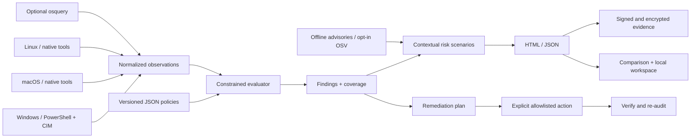

# Architecture

RSAT separates observations, policy decisions, and presentation. The engine does not infer a pass from missing evidence, and audit mode never applies remediation.

Python 3.11+ provides typed models, JSON policy evaluation, CLI orchestration, tests, and packaging. PowerShell is used for Windows-native structured evidence. macOS and Linux collectors call native utilities with explicit arguments; command execution never uses a shell. HTML/CSS/JavaScript provide the self-contained report. Cryptography uses maintained Ed25519, X25519, HKDF-SHA256, and AES-GCM implementations rather than handwritten primitives.

| Directory | Responsibility |
|---|---|
| `src/rsat/collectors.py` | Platform collection and typed native output parsing |
| `src/rsat/runner.py` | Trusted utility resolution, deadlines, process termination, output limits |
| `src/rsat/model.py` | Versioned audit data and validation |
| `src/rsat/policy.py`, `policies/` | Original declarative controls and expiring exceptions |
| `src/rsat/analysis.py`, `intelligence.py` | Explainable risk factors, inventory matches, public intelligence |
| `src/rsat/report.py` | Responsive standalone report and local engagement overview |
| `src/rsat/bundle.py` | Integrity, pinned signing verification, recipient encryption |
| `src/rsat/remediation.py` | Plans, explicit actions, saved state, verification, rollback |
| `src/rsat/transport.py` | Existing SSH transport and explicit TCP reachability probes |
| `src/rsat/exports.py` | OSCAL pairing and optional cited local model prose |
| `tests/`, `scripts/` | Regression cases, native smoke, build and validation tools |

Each observation has an ID, value, collection state, source, timestamp, reason, and duration. A finding records its control ID, rule version, outcome, severity, evidence links, and recommended action. Outcome and severity are independent; an operational exception retains the observed outcome.

The core pack contains platform-specific controls. Coverage counts only applicable controls and must not be interpreted as a global security percentage. Some results require independent evidence: backup restoration, externally observed reachability, accurate vendor vulnerability matching, and organization-specific support or policy exceptions.

Native calls have per-command and overall budgets. Collection failures retain partial evidence. Optional deep inventory and live update searches require explicit flags. Queries expose neither disk recovery passwords nor endpoint credentials.

SSH requires a verified host key and pre-existing RSAT on the target. It does not upload executables, store passwords, or enroll a persistent agent. The local web server binds only to loopback and serves one chosen report; it does not expose a directory or execution API.

The evidence bundle signs exact manifest bytes and checks every listed file hash. Trust requires a separately pinned public key. Encryption authenticates both ciphertext and header. Local plaintext artifacts remain available; encryption is intended for recipient transfer rather than proof that local evidence has been erased.

OSCAL exports reference an assessment plan and an organization-supplied system security plan. Schema-valid output is not equivalent to a complete organizational compliance assessment.
